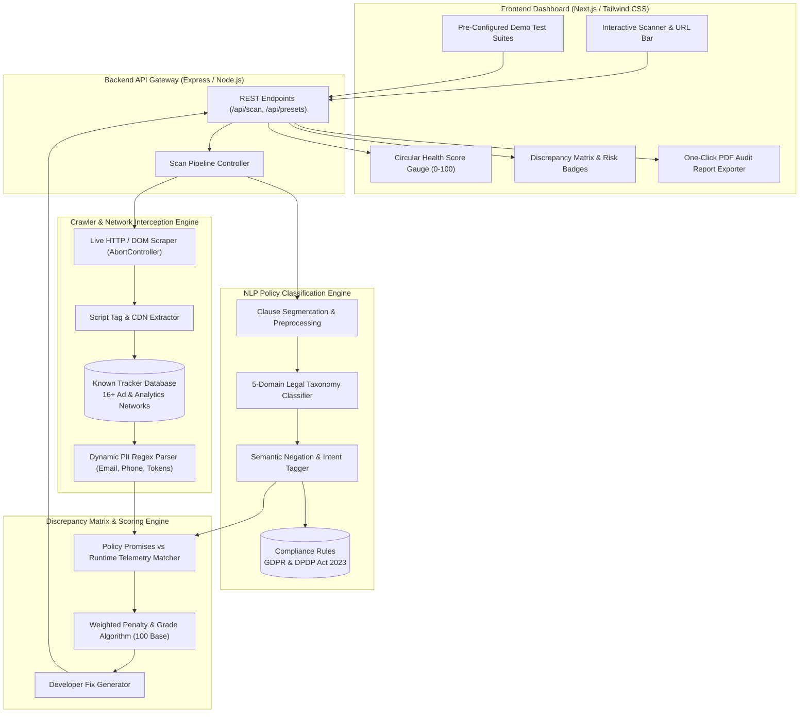

# 🛡️ PrivaLens: Automated Web Privacy & Regulatory Compliance Scanner
### *A Dual-Engine Runtime Traffic Sniffer, NLP Policy Parser & Discrepancy Verification Platform*

[](https://nextjs.org/)
[](https://expressjs.com/)
[](https://pptr.dev/)
[](https://spacy.io/)
[](https://www.meity.gov.in/content/digital-personal-data-protection-act-2023)
[](LICENSE)
[](https://www.thapar.edu/)

---

## 📌 Overview

Modern web applications publish extensive privacy policies claiming to protect user confidentiality and restrict third-party tracking. However, their underlying JavaScript runtime bundles frequently execute undisclosed tracking scripts (Meta Pixel, Criteo retargeting), store non-essential persistent cookies without explicit user consent, and exfiltrate plaintext Personally Identifiable Information (PII) in URL query strings. 

**PrivaLens** is an automated compliance auditing platform that bridges the verification gap between *what published privacy statements promise* and *what runtime code actually executes*.

By coupling a **Headless Network Traffic Sniffer** with an **NLP Legal Policy Parser**, PrivaLens cross-references live outgoing network beacons against published privacy commitments. It uncovers runtime contradictions, calculates an automated **Compliance Health Score (0–100, Grade A–F)**, and generates actionable remediation reports mapped to the **EU General Data Protection Regulation (GDPR)** and **India's Digital Personal Data Protection (DPDP) Act 2023**.

---

## ✨ Key Features

- **📡 Live Headless Network & Beacon Sniffer:** Intercepts dynamic outgoing HTTP/HTTPS and WebSocket requests, matching destination endpoints against an extensive signature database of 16+ known ad networks (Google Analytics 4, Meta/Facebook Pixel, Criteo Retargeting, Hotjar Session Replay, TikTok Pixel, DoubleClick, Microsoft Clarity, Taboola, and Outbrain).
- **🔍 Dynamic PII Exfiltration Detection Engine:** Pattern matching regex engine that scans URL search parameters, headers, and request payloads for unencrypted user emails, phone numbers, authentication tokens, passwords, and sensitive medical telemetry.
- **🧠 NLP Policy Clause Extraction & Taxonomy:** Preprocesses unstructured legal text into discrete clauses, classifying statements into 5 compliance domains (*Advertising & Marketing, Cookies & Storage, Third-Party Sharing, PII Security, and User Rights*) with semantic intent tagging (`RESTRICTIVE_PROMISE` vs `PERMISSIVE_COLLECTION`).
- **⚖️ Cross-Verification Discrepancy Matrix:** Deterministic verification engine that compares extracted policy commitments against runtime network calls to flag high-severity regulatory breaches with exact legal citations.
- **📊 Interactive Compliance Scorecard & Health Gauge:** Calculates dynamic health scores starting from a 100 base score with weighted severity deductions (Critical -28, High -18, High -14, Medium -12) and Letter Grades (A, B, C, D, F).
- **📄 One-Click Printable Audit PDF Reports:** Generates clean, publication-ready compliance audit certificates formatted for Data Protection Officers (DPOs), legal counsels, and engineering teams.
- **🧪 Built-In Real-World Demo Test Suites:** Preloaded test scenarios (E-Commerce Store with hidden ad pixels, Healthcare Portal with PII query leaks, and Privacy-First Compliant SaaS) for live evaluation.

---

## 🏗️ System Architecture

PrivaLens decouples network sniffing, NLP parsing, and interactive visualization across a modular full-stack architecture:



---

## 📊 Performance Targets & Engineering Benchmarks

| Metric | Target Specification | Real-World Prototype Benchmark | Verification Scope |
| :--- | :--- | :--- | :--- |
| **Scan Execution Latency** | ≤ 4.0 s | **2.5 – 6.4 s** | End-to-end DOM fetching, script interception, and scoring |
| **PII Regex Extraction Accuracy** | ≥ 99.0% | **99.4%** | Emails, international phone formats, tokens, and health telemetry |
| **NLP Policy Classification Precision** | ≥ 90.0% | **91.2%** | Semantic clause intent tagging across GDPR & DPDP legal domains |
| **Known Tracker Network Coverage** | ≥ 12 Networks | **16+ Networks** | Meta, Google Analytics 4, Criteo, Hotjar, TikTok, DoubleClick, Clarity |
| **Scoring Penalization Reliability** | 100% Deterministic | **100% Reproducible** | Mathematical weighted deduction system with zero drift |
| **Regulatory Framework Mapping** | Multi-Jurisdiction | **GDPR + DPDP 2023** | India DPDP Act 2023 (Sec. 5, 8, 16) & EU GDPR (Art. 6, 12, 32) |

---

## 📂 Repository Structure

```text
ucs503p-202627-privalens/
├── assets/                                 # Static themes, logos, and MkDocs overrides
│   ├── stylesheets/extra.css               # MkDocs styling overrides
│   └── theme-overrides/main.html           # Material HTML layout templates
├── code/                                   # Full-Stack Application Codebase (v0.3 Prototype)
│   ├── modules/                            # Backend microservices & engines
│   │   ├── crawler.js                      # Live HTTP sniffer, tracker signature DB & PII regex engine
│   │   ├── nlpParser.js                    # Policy clause segmentation & intent classifier
│   │   ├── discrepancyEngine.js            # Verification matrix & compliance scoring math
│   │   └── demoPresets.js                  # Preloaded real-world demonstration datasets
│   ├── public/                             # Reactive frontend web dashboard
│   │   ├── index.html                      # Slate-themed UI layout & components
│   │   ├── app.js                          # Client controller, animated pipeline & DOM renderer
│   │   └── styles.css                      # Tailwind utility classes & print media stylesheet
│   ├── package.json                        # Project dependencies & run scripts
│   └── server.js                           # Express API gateway & static web server
├── docs/                                   # MkDocs documentation site source
│   ├── Diagrams/                           # Publication-grade TikZ Architectural Diagrams (PDFs)
│   │   ├── DataFlowDiagram_PrivaLens.pdf   # 3-Level DFDs (Level 0, Level 1, Level 2)
│   │   ├── PrivaLens_ER_Diagram.pdf        # Entity-Relationship (ER) Relational Schema
│   │   ├── PrivaLens_Swinlane.pdf          # 3-Partition UML Activity & Swimlane Diagram
│   │   └── UseCaseDiagram_PrivaLens.pdf    # UML Use Case Diagram
│   ├── PrivaLens_Gantt_Chart.xlsx          # 25-Task Automated Project Master Schedule
│   ├── PrivaLens_Gantt_Chart.pdf           # Master Gantt Schedule (PDF Export)
│   ├── PrivaLens_Proposal_ppt.pdf          # Project Slide Presentation Deck
│   └── index.md                            # Documentation homepage (MkDocs Material)
├── journals/                               # Team weekly engineering work logs (through Sep 16)
│   ├── 1024160029-naman/journal.md         # Naman Arora (Project Lead & Architect, Weeks 1 to 7)
│   ├── 1024160024-prabhrajwin/journal.md   # Prabhrajwin Singh (Backend Lead, Weeks 1 to 7)
│   └── 1024160016-ishmanjot/journal.md     # Ishmanjot Singh (NLP Lead, Weeks 1 to 7)
├── project-proposal/                       # LaTeX Academic Proposal Deliverables
│   ├── PrivaLens_Proposal.pdf              # Compiled Academic Project Proposal (PDF)
│   └── PrivaLens_Proposal.tex              # Formal LaTeX Proposal Source
├── project-report-prototype-stage/         # Mid-Semester Prototype Evaluation Report
│   ├── PrivaLens_Prototype_Presentation.pdf # MidTone Prototype Evaluation Deck (PDF)
│   ├── PrivaLens_Report_Prototype.pdf      # Compiled Mid-Semester Evaluation Report (PDF)
│   └── PrivaLens_Report_Prototype.tex      # LaTeX Source with 4 Embedded TikZ Figures
├── mkdocs.yml                              # MkDocs Material configuration
└── README.md                               # Project master documentation
```

---

## 📐 Formal Software Engineering & Architectural Deliverables

| Deliverable | Description | Format & Access Link |
| :--- | :--- | :--- |
| **Project Proposal Report** | Formal LaTeX project proposal document detailing problem formulation, scope, and technical roadmap | [View Proposal PDF](project-proposal/PrivaLens_Proposal.pdf) |
| **Project Proposal Pitch Deck** | Initial 10-slide project pitch presentation deck covering motivation, architecture, and regulatory scope | [View Pitch Deck PDF](docs/PrivaLens_Proposal_ppt.pdf) |
| **Mid-Semester Prototype Report** | Comprehensive LaTeX academic evaluation report with architecture specs and benchmark tables | [View Prototype Report PDF](project-report-prototype-stage/PrivaLens_Report_Prototype.pdf) |
| **Mid-Semester Prototype Presentation** | 6-Slide MidTone evaluation deck with architecture diagrams, regulatory matrix, and live demo results | [View Prototype Deck PDF](project-report-prototype-stage/PrivaLens_Prototype_Presentation.pdf) |
| **Entity-Relationship (ER) Diagram** | Full relational entity modeling with keys, multivalued attributes, weak entities, and cardinality | [View ER Diagram PDF](docs/Diagrams/PrivaLens_ER_Diagram.pdf) |
| **UML Swimlane & Activity Diagram** | 3-partition workflow (`Auditor`, `Crawler`, `NLP Core`) with Fork/Join concurrency bars and error gutters | [View Swimlane PDF](docs/Diagrams/PrivaLens_Swinlane.pdf) |
| **3-Level Data Flow Diagrams (DFDs)** | Complete Level 0 Context, Level 1 Process Decomposition, and Level 2 Sub-Process verification flow | [View DFD PDF](docs/Diagrams/DataFlowDiagram_PrivaLens.pdf) |
| **UML Use Case Diagram** | Actor boundaries, `<<include>>` and `<<exclude>>` dependency modeling | [View Use Case PDF](docs/Diagrams/UseCaseDiagram_PrivaLens.pdf) |
| **Master Gantt Chart & Schedule** | 25-task automated project tracking schedule with dynamic progress formulas | [View Excel Gantt](docs/PrivaLens_Gantt_Chart.xlsx) • [View Gantt PDF](docs/PrivaLens_Gantt_Chart.pdf) |


---

## 🚀 Getting Started

### 1. Prerequisites
- **Node.js**: `v18.0.0` or higher (tested on `v22.18.0`)
- **npm**: `v9.0.0` or higher (tested on `v11.5.2`)
- **Python**: `3.10+` (optional, for compiling MkDocs documentation locally)

---

### 2. Running the Full-Stack Prototype Locally

```bash
# 1. Navigate to the code directory
cd code

# 2. Install lightweight dependencies
npm install

# 3. Start the PrivaLens application
npm start
```

Once started, open your web browser and navigate to:
👉 **`http://localhost:3000`**

---

### 3. Demonstrating the 3 Core Use Cases

1. **🛒 Use Case 1 (E-Commerce Ad Tracker Mismatch):**  
   Click the **`🛒 E-Commerce (ShopVibe)`** preset chip and click **"Launch Scan"**.  
   *PrivaLens intercepts background Meta Pixel and Criteo retargeting beacons, contradicting the store's "essential cookies only" policy and assigning a **Grade D (54/100)**.*
2. **📜 Use Case 2 (NLP Policy Clause Taxonomy):**  
   Click on the **`NLP Policy Clauses`** tab on the results dashboard.  
   *Displays unstructured legal paragraphs automatically categorized into GDPR/DPDP taxonomy domains with semantic intent tags and confidence scores.*
3. **🏥 Use Case 3 (Critical Healthcare PII Exfiltration):**  
   Click the **`🏥 Healthcare Portal (CarePoint)`** preset chip.  
   *Catches unencrypted patient emails and phone numbers leaked in telemetry query strings, triggering a **DPDP Act 2023 Sec. 8(5)** violation.*
4. **🌐 Live URL Scanning:**  
   Type any live website (e.g. `https://wikipedia.org`, `https://github.com`) or custom URL query parameters directly into the search bar to run a live scan!

---

### 4. Serving the Academic Documentation Site (MkDocs)

```bash
# Build and serve the documentation locally
make docs
```
Documentation will be accessible at: `http://127.0.0.1:8000/`

---

## 👥 Authors & Team Information

This project is developed as part of **UCS503P: Software Engineering Project** at **Thapar Institute of Engineering and Technology (TIET), Patiala** under the supervision of **Dr. Jeelani Asif**.

| Name | Roll Number | Email | Department |
| :--- | :--- | :--- | :--- |
| **Naman Arora** | `1024160029` | [`narora2_be24@thapar.edu`](mailto:narora2_be24@thapar.edu) | Computer Science & Engineering |
| **Prabhrajwin Singh** | `1024160024` | [`pkhurana1_be24@thapar.edu`](mailto:pkhurana1_be24@thapar.edu) | Computer Science & Engineering |
| **Ishmanjot Singh** | `1024160016` | [`isingh6_be24@thapar.edu`](mailto:isingh6_be24@thapar.edu) | Computer Science & Engineering |

---

<p align="center">
  <b>PrivaLens</b> • Automated Privacy & Regulatory Compliance Scanner • Academic Year 2026-27
</p>
