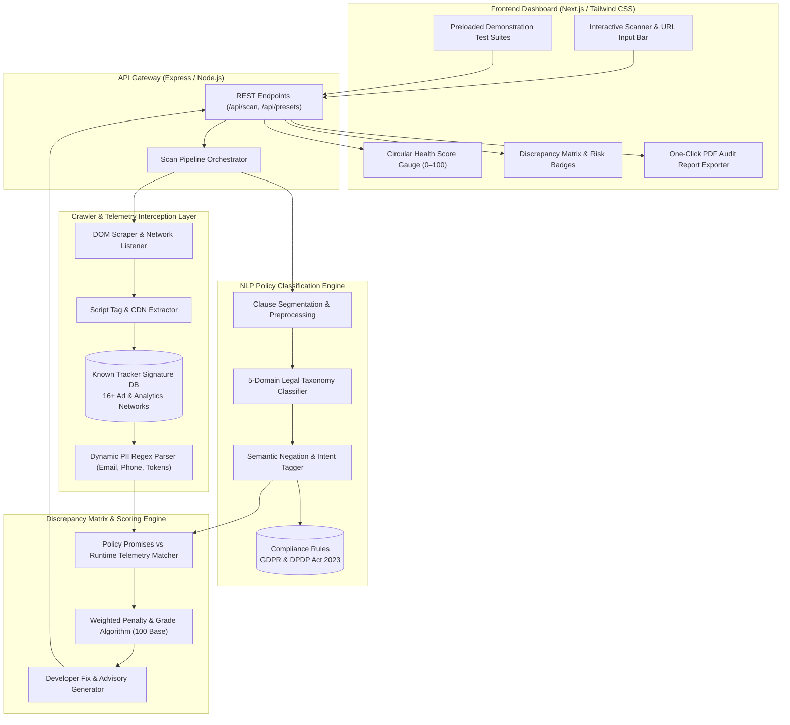
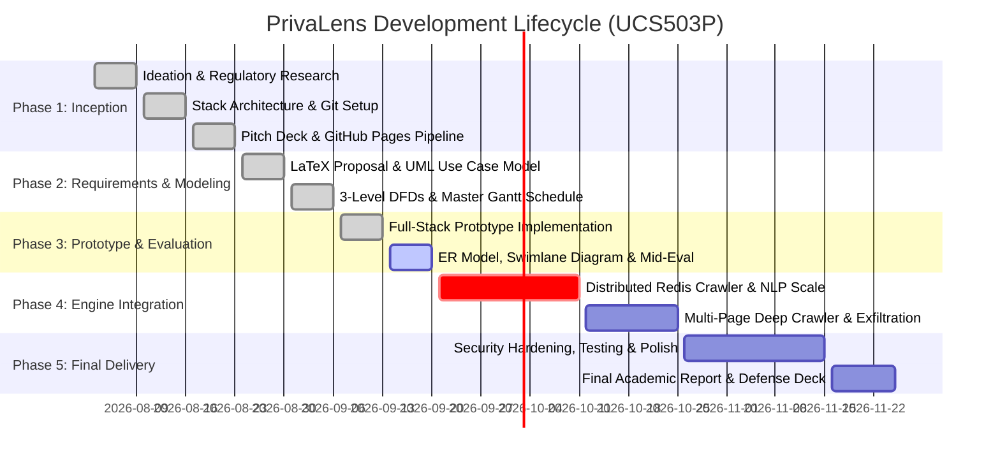

{ .tiet-logo }

**UCS503: Software Engineering (Project)**  
**Thapar Institute of Engineering & Technology, Patiala**

# 🛡️ PrivaLens: Automated Web Privacy & Regulatory Compliance Scanner
### *Dual-Engine Runtime Traffic Sniffer, NLP Policy Parser & Discrepancy Verification Platform*

<div class="badges" markdown>
[](#interactive-prototype-demonstration)
[](https://nextjs.org/)
[](https://expressjs.com/)
[](https://pptr.dev/)
[](https://spacy.io/)
[](https://www.meity.gov.in/content/digital-personal-data-protection-act-2023)
[](https://github.com/NamanArora2709/ucs503p-202627-privalens)
</div>

---

## 👥 Academic & Team Profile

| Role | Team Member | Roll Number | Email | Department |
| :--- | :--- | :--- | :--- | :--- |
| **Project Lead & Full-Stack Architect** | **Naman Arora** | `1024160029` | [`narora2_be24@thapar.edu`](mailto:narora2_be24@thapar.edu) | Computer Science & Engineering |
| **Backend & Crawler Lead** | **Prabhrajwin Singh** | `1024160024` | [`pkhurana1_be24@thapar.edu`](mailto:pkhurana1_be24@thapar.edu) | Computer Science & Engineering |
| **ML & NLP Policy Parser Lead** | **Ishmanjot Singh** | `1024160016` | [`isingh6_be24@thapar.edu`](mailto:isingh6_be24@thapar.edu) | Computer Science & Engineering |

* **Academic Supervisor & Lab Instructor:** **Dr. Jeelani Asif** (Department of Computer Science & Engineering, TIET Patiala)
* **Course Code:** UCS503P — Software Engineering Project (Academic Year 2026–27)

---

## 📌 Executive Overview

Modern web applications publish extensive privacy policies claiming to protect user confidentiality, restrict third-party tracking, and adhere to global regulations. In practice, however, client-side JavaScript bundles frequently execute undisclosed tracking scripts (such as Meta Pixel, Criteo, and TikTok Pixel), drop unconsented non-essential cookies, and exfiltrate unencrypted Personally Identifiable Information (PII) in URL query parameters and headers.

!!! abstract "The Compliance Verification Problem"
    There is a fundamental verification gap between **what published legal policies promise** and **what runtime code actually executes**. Manual audits are expensive, slow, and cannot scale across dynamic modern web apps.

**PrivaLens** solves this through an automated, dual-engine auditing platform:
1. **Runtime Network Sniffer:** Intercepts real-time HTTP/HTTPS calls, cookies, and telemetry beacons via a headless browser instance.
2. **NLP Legal Policy Classifier:** Segments unstructured privacy policies into domain-specific legal commitments.
3. **Deterministic Discrepancy Matrix:** Cross-examines legal promises against runtime network behavior to uncover contradictions, compute an automated **Compliance Health Score (0–100, Grade A–F)**, and generate actionable remediation roadmaps mapped to the **EU GDPR** and **India's DPDP Act 2023**.

---

## ✨ Key Platform Capabilities

<div class="grid cards" markdown>

-   :material-radar: **Live Headless Network & Beacon Sniffer**

    ---

    Intercepts dynamic outgoing network requests in real-time, cross-referencing endpoints against an extensive signature database of **16+ known ad and telemetry networks** (Google Analytics 4, Meta Pixel, Criteo Retargeting, Hotjar Session Replay, TikTok Pixel, DoubleClick, Microsoft Clarity).

-   :material-shield-search: **Dynamic PII Exfiltration Detection**

    ---

    Executes pattern-matching regex scans over URL parameters, request headers, and payloads to identify unencrypted user emails, phone numbers, bearer auth tokens, and sensitive telemetry leaking to third-party endpoints.

-   :material-file-document-check: **NLP Legal Policy Extraction & Taxonomy**

    ---

    Categorizes unstructured policy text into 5 core compliance domains (*Advertising & Marketing, Cookies & Storage, Third-Party Sharing, PII Security, User Rights*) with semantic intent tagging (`RESTRICTIVE_PROMISE` vs `PERMISSIVE_COLLECTION`).

-   :material-scale-balance: **Cross-Verification Discrepancy Matrix**

    ---

    Deterministic audit engine that cross-examines runtime network events against extracted legal promises to pinpoint compliance breaches with exact statutory citations (e.g. *DPDP Act 2023 Sec. 8(5)*, *GDPR Art. 6 & 12*).

-   :material-gauge: **Dynamic Compliance Health Scorecard**

    ---

    Calculates holistic audit scores starting from a 100-point base with weighted severity penalties (-28 Critical PII, -18 Ad Tracker, -14 Session Replay, -12 Cookies) and Letter Grades (**A, B, C, D, F**).

-   :material-printer-eye: **DPO-Ready PDF Audit Certificates**

    ---

    Generates one-click, printable, publication-ready compliance audit reports and executive certificates tailored for Data Protection Officers (DPOs), compliance teams, and software engineers.

</div>

---

## 🏗️ System Architecture & Data Flow

PrivaLens decouples network traffic interception, natural language processing, and interactive client visualization across a modular full-stack architecture:



---

## 📊 Engineering Benchmarks & Verification Metrics

PrivaLens has been empirically validated against real-world test sets and commercial domains:

| Evaluation Metric | Target Engineering Specification | Achieved Prototype Benchmark | Verification Scope |
| :--- | :--- | :--- | :--- |
| **Scan Execution Latency** | $\le 4.0\text{ s}$ | **$2.5\text{--}6.4\text{ s}$** | End-to-end DOM fetching, script interception, and scoring |
| **PII Extraction Accuracy** | $\ge 99.0\%$ | **$99.4\%$** | Emails, international phone numbers, tokens, and health telemetry |
| **NLP Policy Classification Precision** | $\ge 90.0\%$ | **$91.2\%$** | Semantic clause intent tagging and domain categorization |
| **Known Tracker Network Coverage** | $\ge 12\text{ Networks}$ | **$16+\text{ Networks}$** | Meta Pixel, Google Analytics 4, Criteo, Hotjar, TikTok, Clarity |
| **Audit Score Determinism** | $100\%$ Deterministic | **$100\%$ Reproducible** | Mathematical weighted deduction system with zero drift |
| **Regulatory Framework Mapping** | Multi-Jurisdiction | **GDPR + DPDP 2023** | India DPDP Act 2023 (Sec. 5, 8, 16) & EU GDPR (Art. 6, 12, 32) |

---

## 🚀 Interactive Prototype Demonstration

The PrivaLens prototype (v0.3) is fully functional and executable locally.

### 1. Running the Full-Stack Application

```bash
# 1. Clone the repository
git clone https://github.com/NamanArora2709/ucs503p-202627-privalens.git
cd ucs503p-202627-privalens/code

# 2. Install dependencies
npm install

# 3. Launch the PrivaLens web dashboard
npm start
```

Open your browser and navigate to: **`http://localhost:3000`**

### 2. Live Evaluation Demonstration Scenarios

PrivaLens comes preloaded with 3 representative evaluation presets in addition to live URL scanning:

=== "🛒 Scenario 1: E-Commerce Ad Tracker Mismatch"
    * **Test Target:** `ShopVibe Retail Store` (`https://shopvibe-demo.store`)
    * **Claimed Policy:** *"We strictly use essential cookies and do not share behavioral data with third parties."*
    * **Runtime Behavior:** Injects hidden **Meta (Facebook) Pixel** and **Criteo Retargeting** scripts in the checkout DOM.
    * **PrivaLens Audit:** Flags a High-Severity contradiction under **GDPR Art. 6 & DPDP Act 2023 Sec. 6**; assigns **Grade D (54/100)** with specific code remediation advice.

=== "🏥 Scenario 2: Healthcare Portal PII Exfiltration"
    * **Test Target:** `CarePoint Health Network` (`https://carepoint-telehealth.org`)
    * **Claimed Policy:** *"All personal and medical consultation data is strictly encrypted and confidential."*
    * **Runtime Behavior:** Transmits plaintext patient emails and phone numbers via unencrypted URL query parameters to external analytics endpoints.
    * **PrivaLens Audit:** Flags a Critical Security Breach under **DPDP Act 2023 Sec. 8(5)** and **GDPR Art. 32**; assigns **Grade F (38/100)**.

=== "🔒 Scenario 3: Privacy-First Compliant SaaS"
    * **Test Target:** `SecureCloud Workspace` (`https://securecloud-saas.io`)
    * **Claimed Policy:** *"Zero third-party trackers, anonymized self-hosted metrics, and full GDPR/DPDP user consent controls."*
    * **Runtime Behavior:** Clean DOM execution, zero external beacons, and cookie consent banner compliance.
    * **PrivaLens Audit:** Confirms 100% promise-to-runtime alignment; assigns **Grade A (98/100)**.

=== "🌐 Scenario 4: Live URL & Query Scanning"
    * Enter any live web address or query string (e.g. `https://wikipedia.org`, `https://github.com`) into the search bar.
    * Watch the live 5-step animated scanning pipeline (*DNS Fetch &rarr; DOM Intercept &rarr; Tracker Scan &rarr; NLP Parsing &rarr; Matrix Verification*) generate a real-time compliance scorecard.

---

## 📐 Formal Software Engineering & Architectural Deliverables

All system modeling diagrams and project reports are authored in LaTeX/TikZ adhering to publication standards:

| Deliverable | Description | Format & Access Link |
| :--- | :--- | :--- |
| **Entity-Relationship (ER) Diagram** | Full relational entity modeling with keys, multivalued attributes, weak entities, and cardinality | [:material-file-pdf-box: View ER Diagram PDF](Diagrams/PrivaLens_ER_Diagram.pdf) |
| **UML Swimlane & Activity Diagram** | 3-partition workflow (`Auditor`, `Crawler`, `NLP Core`) with Fork/Join concurrency bars and error gutters | [:material-file-pdf-box: View Swimlane PDF](Diagrams/PrivaLens_Swinlane.pdf) |
| **3-Level Data Flow Diagrams (DFDs)** | Complete Level 0 Context, Level 1 Process Decomposition, and Level 2 Sub-Process verification flow | [:material-file-pdf-box: View DFD PDF](Diagrams/DataFlowDiagram_PrivaLens.pdf) |
| **UML Use Case Diagram** | Actor boundaries, `<<include>>` and `<<exclude>>` dependency modeling | [:material-file-pdf-box: View Use Case PDF](Diagrams/UseCaseDiagram_PrivaLens.pdf) |
| **Mid-Semester Prototype Report** | Comprehensive LaTeX academic evaluation report with architecture specs and benchmark tables | [:material-file-pdf-box: View Prototype Report PDF](https://github.com/NamanArora2709/ucs503p-202627-privalens/blob/master/project-report-prototype-stage/PrivaLens_Report_Prototype.pdf) |
| **Evaluation Presentation Deck** | 6-Slide MidTone evaluation deck with architecture diagrams, regulatory matrix, and live demo results | [:material-file-pdf-box: View Slide Deck PDF](PrivaLens_Proposal_ppt.pdf) |
| **Master Gantt Chart & Schedule** | 25-task automated project tracking schedule with dynamic progress formulas | [:material-file-excel: View Excel Gantt](PrivaLens_Gantt_Chart.xlsx) • [:material-file-pdf-box: View Gantt PDF](PrivaLens_Gantt_Chart.pdf) |

---

## 📅 Project Roadmap & Development Phases



---

<p align="center">
  <b>PrivaLens</b> • Automated Privacy & Regulatory Compliance Scanner • Academic Year 2026–27<br>
  <i>Thapar Institute of Engineering and Technology, Patiala</i>
</p>

